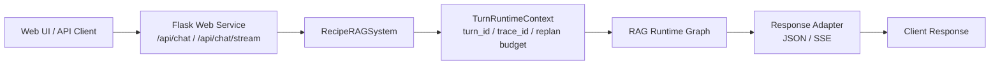
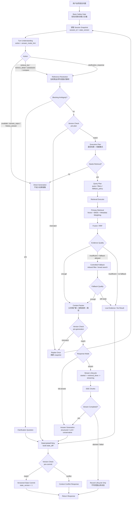

# RAG System

面向中文问答场景的端到端检索增强生成系统。当前项目以食谱问答为落地场景，完整覆盖数据清洗、索引构建、混合检索、多轮状态管理、结构化生成、流式服务和 Live E2E 大模型实测闭环。

这个仓库不是一个只调用 LLM API 的问答 Demo，而是一次完整的 RAG 工程实践：系统把一次用户请求拆解为安全检查、轮次理解、指代解析、执行计划、检索执行、证据质量判断、上下文打包、答案生成和状态提交，并用真实服务与真实模型请求进行端到端验证。

## 项目亮点

- **完整 RAG Runtime**：从用户输入到状态写回形成稳定主链路，不把检索、生成和会话状态混在单个函数里。
- **混合检索与证据质量控制**：结合向量检索、BM25、RRF 融合、元数据过滤、fallback 标记和低证据保护。
- **上下文优先的多轮理解**：支持推荐列表后的序号引用、当前菜品继承、替换/约束追问、闲聊与越界问题隔离。
- **模块化执行边界**：`RetrievalExecutor` 统一管理检索策略，`ContextPacker` 控制上下文输入，`StateUpdatePolicy` 统一状态写入。
- **结构化生成优先**：在食材、步骤、技巧等明确内容类型下优先使用可控模板，减少不必要的模型自由发挥。
- **真实 Live E2E 测评**：启动真实 Flask 服务，调用真实 HTTP/SSE 接口，使用真实大模型完成 85 轮端到端验证。

## 系统架构





主链路围绕一次独立的 turn runtime 展开：请求进入服务后先读取当前 session 快照和 `state_version`，再经过安全检查、轮次理解、指代解析和执行计划，决定是直接回答、拒答、澄清，还是进入检索链路。需要检索时，`RetrievalExecutor` 负责主检索、证据质量判断、受控 fallback、重排和父文档扩展；`ContextPacker` 再把可用证据裁剪成生成层输入。答案生成完成后，系统不会让生成函数直接修改会话，而是由 `StateUpdatePolicy` 构造状态 diff，并在提交前进行版本检查，避免并发或流式中断污染 session 状态。

流式链路单独记录生命周期：`started -> retrieval_done -> streaming -> completed / aborted / failed`。如果客户端中断或生成失败，系统只记录 lifecycle，不把未完成回答当作可靠上下文参与后续指代解析。

## 核心模块

| 模块 | 作用 |
| --- | --- |
| 数据与索引层 | 解析食谱数据，构建结构化文档块和 FAISS 向量索引。 |
| 轮次理解层 | 判断用户意图、答案模式、是否依赖上下文，以及是否需要检索。 |
| 指代解析层 | 处理“第一个”“这个”“刚才那个”等多轮引用，并给出置信度和证据来源。 |
| 检索执行层 | 统一执行主检索、fallback、证据质量判断、重排和父文档扩展。 |
| 上下文打包层 | 根据答案模式选择相关段落，限制上下文长度，避免生成层直接接触原始检索噪音。 |
| 生成与流式层 | 支持结构化答案、LLM 生成、无结果回答和 SSE 流式输出。 |
| 状态提交层 | 通过状态 diff 写回会话，避免低证据或中断流错误污染业务状态。 |
| 测评层 | 提供单元测试、架构验收测试和 Live E2E 真实服务测试报告。 |

## 测评结果

当前项目已经完成真实服务端到端闭环：核心场景集表现稳定，扩展场景集暴露了更复杂多轮和低证据场景下的优化空间。整体结果说明系统已经达到阶段性收尾状态，可以作为完整 RAG 工程项目展示；剩余问题主要用于后续迭代定位，而不是基础链路不可用。

最终展示口径来自 2026-07-08 的 Live E2E 结果，模型为 `qwen-plus-2025-07-28`。这组测试会启动真实 Flask 服务，通过 HTTP/SSE 调用真实接口，并使用真实大模型配置执行多轮场景；它不是单元测试，也不是 mock 测试。

| 测试集 | 轮次 | 通过 | 失败 | 通过率 |
| --- | ---: | ---: | ---: | ---: |
| Core 50 | 50 | 48 | 2 | 96.0% |
| Extended 35 | 35 | 29 | 6 | 82.9% |
| Total 85 | 85 | 77 | 8 | 90.6% |

结果解读：

- Core 50 覆盖单轮详情、推荐列表、多轮引用、替换约束、低证据、越界拒答、SSE 流式和快速追问冲突，通过率达到 96.0%，说明主链路已经稳定。
- Extended 35 用来拉高难度，重点覆盖更复杂的多轮指代、低证据 fallback 和约束追问，通过率为 82.9%，主要用于暴露后续优化空间。
- Total 85 综合通过率为 90.6%，说明系统在真实服务、真实接口和真实模型调用下形成了可复现的评测闭环。
- `INFRA_ERROR = 0` 表示没有服务启动失败、端口冲突、请求超时、进程异常等基础设施问题。
- `RATE_LIMITED = 0` 表示没有因为模型限流导致样本无法评估，因此失败项主要反映系统行为边界，而不是测试环境噪音。

Bad case 主要集中在三类：

- **更长链路的多轮指代**：系统已能处理基础序号引用和当前实体继承，但在更长对话链路里，连续追问、跨轮比较、弱指代混合出现时，仍可能进入低证据路径。
- **低证据 fallback 身份校验**：当用户询问不存在或近似不存在的菜名时，fallback 有时会召回语义相近但身份不一致的菜谱，后续需要更严格地区分“可回答的相似菜”和“应该明确无结果”的场景。
- **约束类追问表达**：部分“适合带饭吗”“能不能少盐”等约束追问可以找到正确菜品，但回答内容未完全覆盖断言关注点，后续可优化答案模式和约束表达模板。

这些 bad case 没有破坏项目闭环，反而明确了下一阶段优化方向：更长上下文、更复杂指代、更严格证据身份判断，以及更细粒度的回答质量评测。

## 工程演进闭环

项目经历了从基础 RAG 到冻结 runtime 架构的演进：

1. 数据准备与索引构建：完成食谱知识库解析、分块、元数据提取和向量索引。
2. 检索增强：加入 BM25、RRF、元数据过滤、别名与安全子串匹配。
3. 多轮对话：引入会话快照、指代解析、推荐列表引用和当前实体继承。
4. Runtime 架构化：拆分 Turn Understanding、Reference Resolution、Execution Plan、Retrieval Executor、Context Packer 和 StateUpdatePolicy。
5. 端到端验收：用 Stage 06 deterministic acceptance 验证冻结主链路。
6. Live E2E 实测：用真实服务和真实模型跑 Core + Extended 场景集，形成可审计报告。

## 快速开始

### 安装依赖

```powershell
cd code/C8
pip install -r requirements.txt
```

### 配置模型密钥

在 `code/C8/.env` 中配置：

```env
DASHSCOPE_API_KEY=your_api_key_here
```

可选配置：

```env
RAG_LLM_MODEL=qwen-plus-2025-07-28
```

### 启动命令行问答

```powershell
cd code/C8
python main.py
```

### 启动 Web 服务

```powershell
cd code/C8
python web_app.py
```

默认访问：

```text
http://127.0.0.1:5000
```

## 测试与评测

### 单元测试

```powershell
cd code/C8
pytest tests -q
```

### 检索执行器测试

```powershell
cd code/C8
pytest tests/test_retrieval_executor.py -q
```

### Live E2E 运行器

```powershell
cd code/C8
python e2e/live_e2e_runner.py `
  --models qwen-plus-2025-07-28 `
  --limit-turns 50 `
  --delay-seconds 5 `
  --max-retries 3 `
  --request-timeout-seconds 120 `
  --stream-timeout-seconds 180
```

生成结果位于：

```text
code/C8/e2e/results/
```

## 项目结构

```text
code/C8/
  main.py                         RAG 主系统入口
  web_app.py                      Flask Web / SSE 服务
  config.py                       配置管理
  rag_modules/
    turn_understanding.py         轮次理解
    reference_resolution.py       指代解析
    execution_planner.py          执行计划
    retrieval_executor.py         检索执行与证据质量
    retrieval_optimization.py     向量/BM25/RRF/元数据检索
    context_packer.py             上下文选择与裁剪
    structured_generation.py      结构化答案生成
    state_update_policy.py        状态 diff 写回策略
    turn_runtime.py               运行时生命周期
  e2e/
    live_e2e_runner.py            Live E2E CLI
    scenarios/                    Core / Extended 场景集
    reporting.py                  JSONL / Markdown 报告生成
  tests/                          单元测试与验收测试
  docs/
    architecture/                 冻结 runtime 架构文档
    architecture/evolution/       分阶段架构演进与验收报告
```

## 后续优化方向

项目当前已经完成展示闭环，后续若继续推进，优先考虑：

- **长链路多轮状态稳定性**：继续增强连续追问、跨轮比较、弱指代和话题切换混合出现时的 reference resolution 和 state consistency。
- **低证据身份边界**：在 fallback 前后加入更强的 dish identity guard，区分别名、合理子串、相似菜名和不存在菜名，降低错误替代回答。
- **约束型回答模式**：针对少盐、少油、不辣、带饭、新手友好等约束问题，沉淀更稳定的 answer mode 和结构化表达。
- **数据与元数据质量**：扩充菜谱规模，补强口味、耗时、难度、适用场景等元数据，让 soft filter 和 recommendation 更有依据。
- **评测指标细化**：在现有 PASS/FAIL 基础上拆出引用解析准确率、检索身份一致性、低证据拒答率、状态写回正确率和答案覆盖度。
